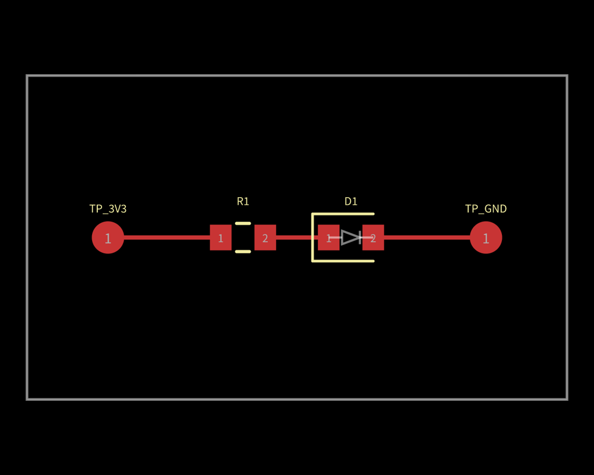
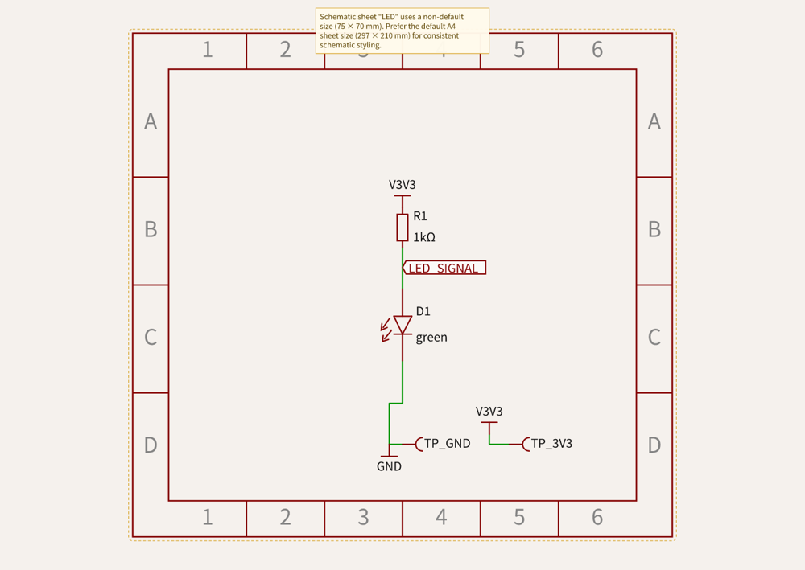
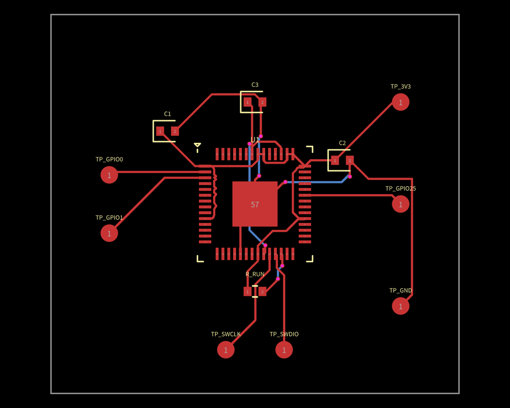
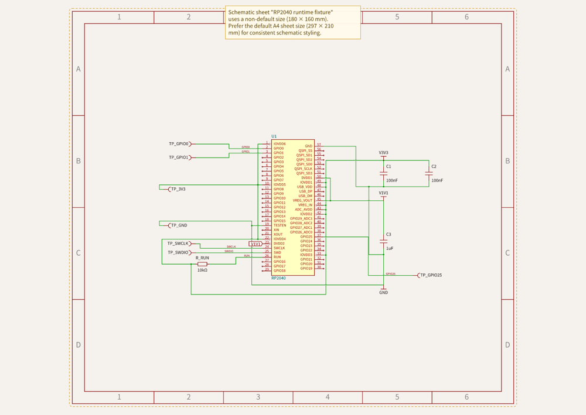
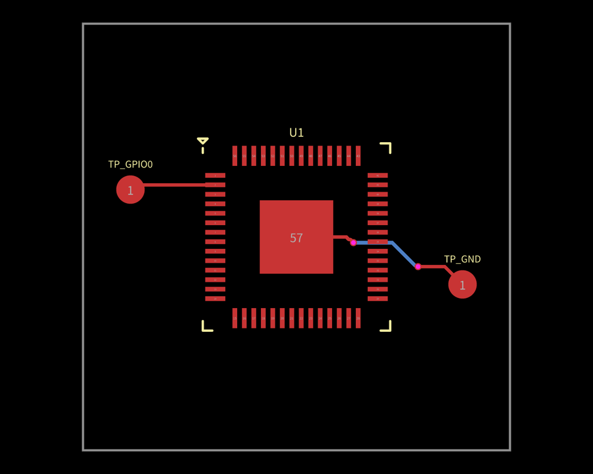
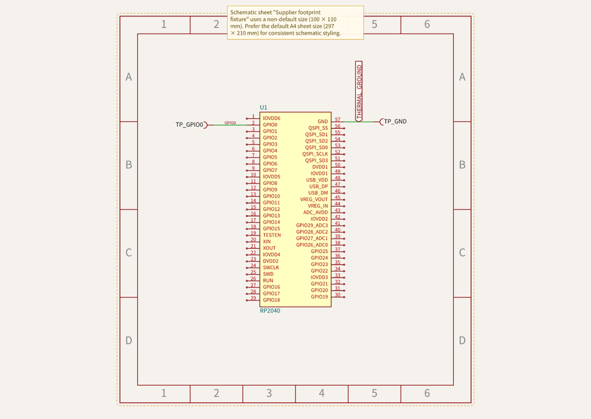

# Offline circuit build inspection

The preparation binary now runs local circuits through an embedded eval/core
worker, routes locally, and emits Circuit JSON, PCB SVG, schematic SVG, and a
JSON report. The examples qualify runtime behavior and connectivity. They are
small test fixtures rather than production electronics designs.

## Reproduce the builds

From the repository root:

```sh
bun install --frozen-lockfile
bun run check
./dist/tsci build examples/led-resistor.circuit.tsx --output-dir build/led
./dist/tsci build examples/rp2040-breakout.circuit.tsx --output-dir build/rp2040
./dist/tsci build examples/supplier-footprint.circuit.tsx --output-dir build/supplier
```

The RP2040 fixture imports the checked-in generated component at
`examples/imports/C2040.tsx`. To create the same component in a new project, use
`tsci import C2040`; it writes `imports/C2040.tsx` and preserves existing files.
The supplier fixture uses `footprint="jlcpcb:C2040"` directly, so it also checks
the platform's local footprint resolver.

Each build directory contains files named after the entry, for example
`rp2040-breakout.circuit.json`, `.pcb.svg`, `.schematic.svg`, and `.report.json`.
The report includes element counts and core error/warning messages. DRC errors
set exit code 1 while retaining Circuit JSON, both SVGs, and the report for
inspection. A footprint-overlap regression checks this behavior. Warnings alone
leave exit code 0. Unsupported dependencies, parts, assets, or offline features
fail before new build artifacts are published. A successful render with no core
errors does not establish electrical completeness or fabrication readiness.

## Inspected fixtures

These results describe the current fixtures with the pinned dependencies.
Route and warning counts should be reviewed when dependencies or examples change.

| Fixture | Total SMT pads | PCB traces | Vias | Core errors | Warnings |
| --- | ---: | ---: | ---: | ---: | ---: |
| LED and resistor | 6 | 3 | 0 | 0 | 3 |
| RP2040 runtime fixture | 72 | 26 | 8 | 0 | 5 |
| Supplier footprint | 59 | 2 | 2 | 0 | 4 |

The LED fixture connects a resistor and LED to supply/ground testpoints, using
local helper imports. Its warnings comprise two missing manufacturer part
numbers and one schematic-sheet warning. The RP2040 fixture has four missing-MPN
warnings for its generic passives and one sheet warning. The supplier fixture
has three warnings from its intentionally incomplete pin metadata and one sheet
warning. These warnings are retained in the output report.

## Review the generated previews

Download the [self-contained gallery](previews/circuit-inspection.html) from
GitHub and open it locally, or expand the fixture previews below. Each fixture
also has linked SVG, Circuit JSON, and diagnostic report files. These snapshots
are generated inspection evidence; none is embedded in the runtime catalog.

<details>
<summary>LED and resistor: PCB and schematic</summary>

[PCB SVG](previews/led-resistor.circuit.pcb.svg) ·
[Schematic SVG](previews/led-resistor.circuit.schematic.svg) ·
[Circuit JSON](previews/led-resistor.circuit.json) ·
[Report](previews/led-resistor.circuit.report.json)





</details>

<details>
<summary>RP2040 runtime fixture: PCB and schematic</summary>

[PCB SVG](previews/rp2040-breakout.circuit.pcb.svg) ·
[Schematic SVG](previews/rp2040-breakout.circuit.schematic.svg) ·
[Circuit JSON](previews/rp2040-breakout.circuit.json) ·
[Report](previews/rp2040-breakout.circuit.report.json)





</details>

<details>
<summary>Supplier footprint: PCB and schematic</summary>

[PCB SVG](previews/supplier-footprint.circuit.pcb.svg) ·
[Schematic SVG](previews/supplier-footprint.circuit.schematic.svg) ·
[Circuit JSON](previews/supplier-footprint.circuit.json) ·
[Report](previews/supplier-footprint.circuit.report.json)





</details>

## RP2040 footprint and thermal ground

The compact catalog stores a footprinter recipe and all 57 physical pin labels,
including `pin57: ["GND", "thermalpad"]`. Build-time footprint qualification
against the pinned reference gives 57 matched copper pads and copper IoU
0.9981788348844475 (99.8179%); the reference geometry is not embedded in the
runtime catalog. See the [CLI audit](cli-audit.md) for source provenance and the
reproducible comparison command.

The rendered RP2040 regression checks U1 independently of the other components:

- U1 has exactly 57 SMT pads.
- Physical pin57 exposes the `GND` alias and its associated PCB port.
- Its rectangular thermal pad measures 3.1 mm by 3.1 mm.
- A source trace connects that ground port, and a routed PCB trace reaches the
  same PCB port.
- The circuit contains no core error elements, and its schematic SVG contains
  component geometry.
- Seven schematic capacitor/testpoint paths geometrically reach the intended
  supply or ground label in the final manually placed fixture.

The larger total of 72 pads includes testpoints, capacitors, and the RUN resistor.
The board exercises supply nets, thermal ground, GPIO, SWD, and local routing.
It assumes external 3.3 V and omits flash, crystal, USB implementation, and full
per-pin decoupling; it must not be used as a production RP2040 reference design.

## Known schematic auto-layout issue

The original automatically placed RP2040 fixture had correct source and PCB
connectivity, but its C1/C2 ground wire cluster lacked a visible GND label.
`schDisplayLabel` did not restore that label. An explicitly authored netlabel
under automatic layout used a stale pre-layout anchor inside U1 rather than
following C2. A nearby V1V1/V3V3 crossing had a proper wire hop; it was not an
electrical short in the source graph.

The example now uses explicit relative schematic component placement and clear
rail labels, with normal routing. Visual inspection and geometric regressions
check the seven capacitor/testpoint paths against those labels. PCB counts and
topology are unchanged. This is a fixture workaround; the general core
auto-layout label/anchor issue remains an upstream follow-up for RunFrame.

## Runtime issues addressed by this milestone

Explicit schematic-sheet membership gives the fixtures populated schematic
previews. The compiled build embeds its worker entry rather than relying on
source files beside the executable. Local files receive unique virtual module
IDs so matching relative import strings in different directories cannot collide
in eval's module cache. Async effect errors and caught offline request failures
are surfaced as build failures. The worker replaces eval's online provider
defaults before rendering and creates the custom platform inside the worker.
The loader prefers exact files, resolves runtime-style extensions such as
`./part.js` to local TS/TSX sources, supports MTS/CTS/MJS/CJS source files, and
preloads dependencies whose Unicode import bindings eval's scanner would otherwise miss. Rendered
regressions exercise these cases.

The evaluator, core, renderers, and runtime dependencies are pinned. A fresh
frozen install caught undeclared evaluator dependencies, which are now explicit
in this repository. Unit/build regressions and compiled-binary smoke cover the
fixtures and local rejection paths.

Each binary build also generates `dist/licenses.json`,
`dist/THIRD_PARTY_NOTICES.txt`, and a compiler metafile. The current inventory
lists 117 bundled package roots and 46 follow-up flags. Those notices include
the pinned Bun license overview, which describes LGPL-licensed linked native
components. Missing notices, prebuilt WASM/native dependencies, and applicable
source/relinking requirements still need a release audit; this inventory does
not certify the binary for redistribution.

## Qualification still pending

The supported loader reads up to 100 reachable local
TS/TSX/JS/JSX/MTS/CTS/MJS/CJS/JSON files, with a combined limit of 2 MiB. Its
exact embedded module names are
`@tscircuit/core`, `tscircuit`, `@tscircuit/math-utils`, `@tscircuit/mm`,
`@tscircuit/props`, `react`, `react/jsx-runtime`, `debug`, and `tslib`.
Package subpaths outside that list are unavailable. Unsupported packages,
dynamic imports, top-level await, CommonJS `require`, external assets, cloud routing, project
configuration imports, custom parts engines, and unknown supplier/MPN declarations
are rejected locally. These restrictions and worker fetch guards are not an OS
sandbox for arbitrary adversarial TypeScript.

The local compiled smoke uses an empty project without project `node_modules`,
tokens, or Bun/Node on PATH. It also generates `imports/C2040.tsx` with the binary
and builds a `src/` circuit importing it through `../imports/C2040`, exercising
the normal project boundary and sibling-import workflow. CI is configured to
trace native network calls on successful builds and missing-part/module or remote-footprint paths, and to run
successful imports/builds in a network namespace; its run for this milestone is
pending. Native qualification is currently limited to Linux. The five
cross-compilation targets still require native tests
before support is announced. RunFrame/dev, simulation, additional exports,
catalog expansion, and an official binary release remain planned.
