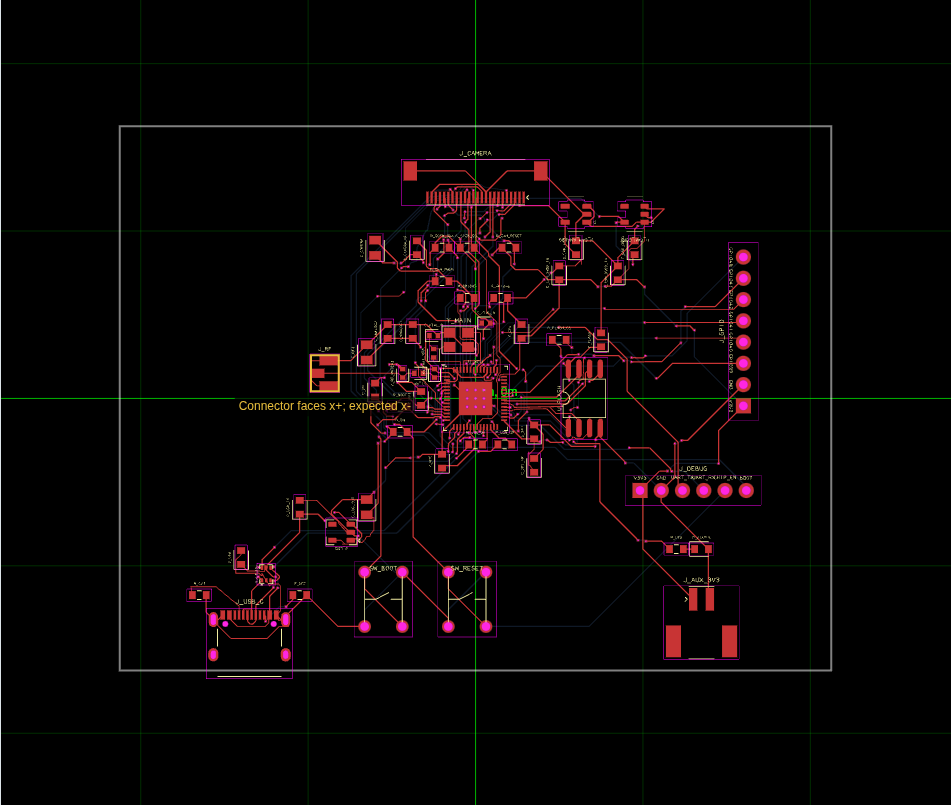
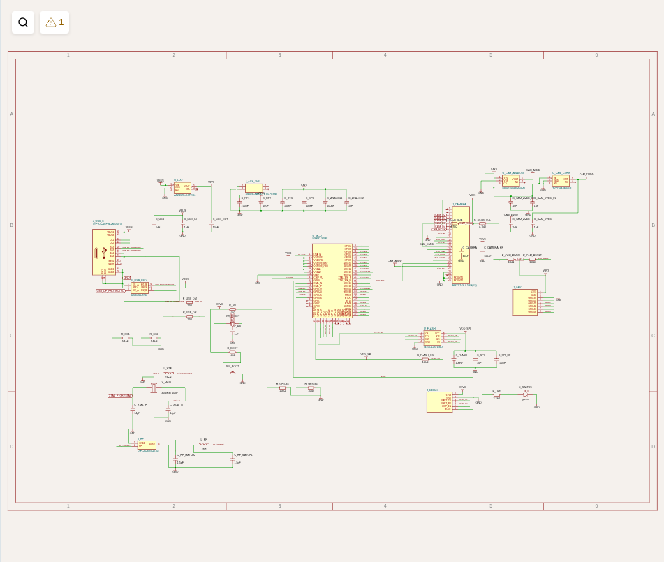
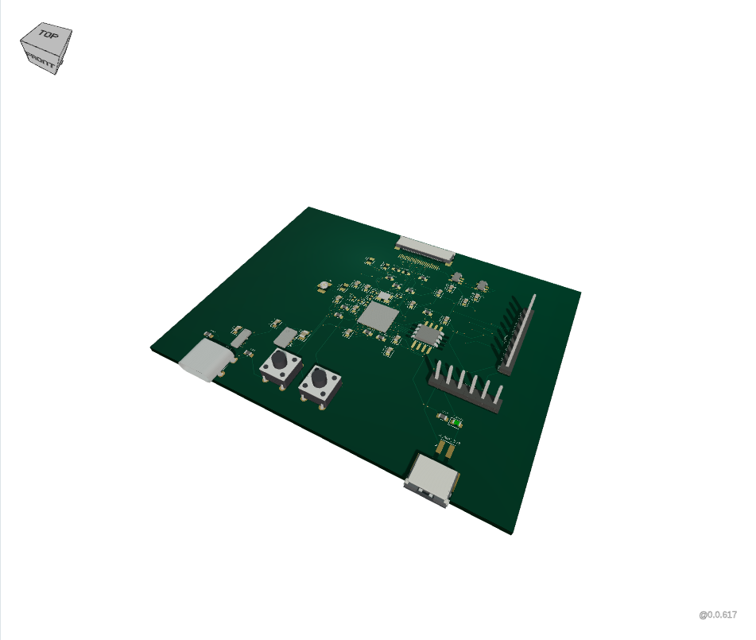

# Bare ESP32-S3 Wi-Fi camera qualification

The [camera controller example](../examples/wifi-camera.circuit.tsx) exercises
eleven actual supplier imports through the compiled standalone binary and
ordinary RunFrame source evaluation. It contains a bare ESP32-S3R8 QFN IC,
external flash, USB-C, power regulators, a crystal, and connectors for an
external OV2640 camera flex and antenna. The authored circuit has 55 components
and 53 named nets. Its in-package PSRAM is part of the IC; no ESP32 radio or
camera module is substituted for these parts.

The [earlier socket-carrier report](wifi-camera-qualification.md) remains as
historical evidence. Its build counts and network measurements do not describe
this circuit. This report qualifies component import and rendering behavior;
camera firmware, radio operation, and manufacturing readiness need hardware
validation.

## Completed qualification

The compiled binary and ordinary browser source evaluation both passed with
zero circuit errors and zero outbound request attempts. The tested source is
[commit b0d6dc0](https://github.com/tscircuit/tscircuit-standalone/tree/b0d6dc045271a182bfb3508b63bd81019bdc4183).
The [evidence summary](previews/discrete-wifi-camera/qualification.json) records
the exact binary, source, lockfile, and dependency archive hashes.

| Check | Native and browser result |
| --- | --- |
| Actual catalog imports | All 11 succeed locally |
| Components / named nets | 55 / 53 |
| Source / PCB terminals | 241 / 241 |
| Numeric physical / schematic pins | 239 / 239 |
| Authored connected endpoints | All 220 connected to their intended nets |
| SMT pads / plated holes | 215 / 26 |
| Routed traces / vias | 167 / 219 |
| Circuit errors / retained warnings | 0 / 53 |

The two extra physical USB shell terminals have declared intrinsic connections
to their numbered shell pins; all four shell tabs are owned and checked. An
independent physical-pin and copper-graph review also passed every named net in
both outputs. The 53 warnings remain visible: 44 generic parts lack MPNs and
nine concern connector metadata/reference prefixes, the A3 sheet, and U.FL
insertion direction. They are not silently filtered.

Native tracing recorded no network attempts from imports or the circuit build,
and no outbound attempts from the dev server. Browser monitoring recorded 1,168 request events for 13
distinct loopback resources, with zero external attempts, CSP violations,
browser/console errors, failed requests, or monitor errors. All six views,
MCU/USB component dialogs, local schematic style analysis, missing-part
failure/recovery, rebuild, and JSON/PCB SVG/schematic SVG downloads passed.
All five altered-circuit calibrations detected their deliberate failures,
including a real VBUS-to-ground thermal-via contact; owned thermal vias with a
live explicit `pcb_trace_id: undefined` remained valid.

The same frozen Bun 1.3.12 install passed backend/UI typechecks, 102 tests with
729 assertions, UI generation, binary compilation, and the original compiled
binary fixture smoke checks. The binary is 174,274,880 bytes with SHA-256
`c506deef94bb9cbde192a52d51161fb593ee427eb8c1fc2550bef50208e45929`.

The test exposed source placement/path-anchor issues, which were corrected,
and reusable library issues. [Core #4487](https://github.com/tscircuit/core/pull/4487)
preserves footprint thermal-via ownership;
[Core #4488](https://github.com/tscircuit/core/pull/4488) retains separate copper
terminals for shared USB shell pins even with an explicit schematic arrangement.
[Checks #403](https://github.com/tscircuit/checks/pull/403) fixes identifier
selection when live via objects contain `pcb_trace_id: undefined`: use the
object's actual via ID instead of treating the undefined value as a trace ID.
Exported JSON omits that field, so reproducing the live object was necessary to
identify the false contacts. The final run uses the pinned corrected artifacts
and still detects real cross-net contacts.







## Imported parts

| Reference | Supplier part | Manufacturer part | Function |
| --- | --- | --- | --- |
| U_MCU | [C2913194](https://jlcpcb.com/partdetail/C2913194) | ESP32-S3R8 | Bare Wi-Fi/Bluetooth MCU; 8 MB in-package octal PSRAM |
| U_FLASH | [C97521](https://jlcpcb.com/partdetail/C97521) | W25Q128JVSIQ | 16 MB external SPI flash |
| U_LDO | [C23380830](https://jlcpcb.com/partdetail/C23380830) | AP2112K-3.3TRG1 | Main 3.3 V supply from USB VBUS |
| U_USB_ESD | [C2827693](https://jlcpcb.com/partdetail/C2827693) | USBLC6-2P6 | USB data ESD protection |
| J_USB_C | [C2765186](https://jlcpcb.com/partdetail/C2765186) | TYPE-C-16PIN-2MD(073) | USB-C power and data connector |
| J_AUX_3V3 | [C265417](https://jlcpcb.com/partdetail/C265417) | SM02B-PASS-TBT(LF)(SN) | Regulated 3.3 V power output |
| J_CAMERA | [C202112](https://jlcpcb.com/partdetail/C202112) | FH12-24S-0.5SH(55) | 24-contact bottom-contact camera flex connector |
| Y_MAIN | [C5210647](https://jlcpcb.com/partdetail/C5210647) | X322540MMB4SI | 40 MHz, 10 pF load crystal |
| U_CAM_ANALOG | [C53099](https://jlcpcb.com/partdetail/C53099) | ME6211C28M5G-N | Camera 2.8 V analog supply |
| U_CAM_CORE | [C2868517](https://jlcpcb.com/partdetail/C2868517) | TLV70013DDCR | Camera 1.3 V core supply |
| J_RF | [C88373](https://jlcpcb.com/partdetail/C88373) | U.FL-R-SMT-1(10) | External antenna connector |

Each generated import keeps a compact footprinter string, physical pin labels,
supplier/manufacturer identity, and provenance. Expanded acquisition geometry
and remote CAD assets are excluded. The
[catalog measurements](camera-catalog-qualification.json) record copper/hole
IoU, pad counts, pin parity, reference digests, and compact record sizes; see
the [admission policy](catalog-policy.md). A separate 1.2 V regulator is present
in the catalog but is not used for the OV2640 core supply.

The tested build pins reviewed prebuilt dependency artifacts for the generic
connector and via corrections: [Core provenance](../vendor/core-5c896e0.source.json),
[Checks provenance](../vendor/checks-0b1d656.source.json), and
[procedural U.FL CAD provenance](../vendor/jscad-electronics-1d107c3.source.json).
The Checks source/archive has no declared package license or license file;
redistribution licensing remains a release-audit item, as recorded in its
provenance and [notice](../vendor-notices/checks-0b1d656-NOTICE.txt).

## Electrical and physical pin review

The [Espressif ESP32-S3 datasheet](https://www.espressif.com/sites/default/files/documentation/esp32-s3_datasheet_en.pdf)
and [hardware schematic checklist](https://docs.espressif.com/projects/esp-hardware-design-guidelines/en/latest/esp32s3/schematic-checklist.html)
establish the MCU connections. Physical pins 2, 3, 20, 46, 55, and 56 connect to
3.3 V; exposed pad 57 connects to ground. VDD_SPI pin 29 supplies external flash
VCC on a separate rail with 0.1 µF and 1 µF decoupling. GPIO45 is pulled low to
select the 3.3 V flash supply. GPIO0 has a boot pull-up/button, GPIO46 is pulled
low, and CHIP_PU has the recommended initial 10 kΩ/1 µF reset delay. GPIO3 is
unused; the default eFuse configuration ignores its JTAG-selection strap.

| MCU physical pin | Flash physical pin | Signal |
| --- | --- | --- |
| 30 | 7 | SPIHD / IO3 |
| 31 | 3 | SPIWP / IO2 |
| 32 | 1 | SPICS0 / CS |
| 33 | 6 | SPICLK / CLK |
| 34 | 2 | SPIQ / DO / IO1 |
| 35 | 5 | SPID / DI / IO0 |
| 29 | 8 | VDD_SPI / VCC |
| 57 | 4 | Ground |

MCU pin 28 and pins 38–42 are reserved for the in-package octal PSRAM and are
not used for external camera/header signals. USB GPIO19/20 are physical pins
25/26, respectively D−/D+. Each data line has a 22 Ω series resistor and the
ESD channels are pins 1/6 and 3/4. The two USB-C CC contacts each have their own
5.1 kΩ pull-down. USB-C contact numbers in the compact recipe retain its supplier
reference: shell pins 13/14, contacts 15–26, CC1 18, CC2 24, D− 19/21, D+ 20/22,
VBUS 16/25 and ground 15/26.

The 40 MHz crystal uses pads 1/3 for the oscillator and 2/4 for ground.
XTAL_P pin 54 passes through the initial 24 nH series inductor; its load
capacitor connects on the crystal side, as in the
[Espressif crystal reference](https://github.com/espressif/esp-hardware-design-guidelines/blob/master/docs/_static/esp32s3/esp32s3-sche-external-crystal.png).
XTAL_N pin 53 connects to the other crystal terminal and load capacitor.
Critical traces use native `pcbPath` geometry. All oscillator branches retain
zero-via and 10 mm maximum-length checks.

The camera flex mapping follows the
[Seeed/Ai-Thinker reference schematic](https://github.com/SeeedDocument/forum_doc/blob/master/reg/ESP32_CAM_V1.6.pdf).
The sensor/lens is external. Physical flex pins and MCU pins are reviewed
independently of the component symbol aliases:

| Camera function | Flex physical pins | MCU physical pins |
| --- | --- | --- |
| D0–D7 (Y2–Y9) | 6, 4, 3, 5, 7, 9, 11, 13 | 9–16, respectively |
| PCLK, VSYNC, HREF | 8, 18, 16 | 17, 18, 19 |
| XCLK, SIOC, SIOD | 12, 20, 22 | 21, 22, 23 |
| PWDN, RESET | 17, 19 | 24, 27 |
| DOVDD, DVDD, AVDD | 14, 15, 21 | 3.3 V, 1.3 V, 2.8 V rails |
| Ground and mounting pads | 10, 23, 25, 26 | Ground |
| Unused | 1, 2, 24 | Unconnected |

The [OV2640 v2.21 primary electrical table](https://media.githubusercontent.com/media/tiacsys/bridle-electronic/3c16b4233688a7e283e2df8bd10d704cee18f652/components/omnivision/OV2640/OV2640-OV2141-datasheet-v2.21-20070911.pdf)
specifies core DVDD 1.24–1.36 V, typically 1.3 V; the older carrier reference's
1.2 V rail was corrected. The
[TI TLV700 datasheet](https://www.ti.com/lit/ds/symlink/tlv700.pdf) specifies
1.3 V ±2%, fitting that range. PWDN and RESET have external 10 kΩ default pulls
because the sensor has no internal pulls. The analog rail is 2.8 V and digital
I/O follows the reference's nominal 3.3 V rail. The sensor's specified operating
maximum is also 3.3 V, so positive regulator tolerance needs review; choosing a
lower I/O supply also requires checking sensor/MCU logic-level compatibility.
U.FL retains ground pads 1/3 and RF pad 2; the matching network connects the
MCU's LNA_IN pin 1 to that real antenna connector.

## Hardware and rendering limits

The RF matching values are initial values, with the chip CLC placed near
LNA_IN. Its presence does not establish 50 Ω impedance, antenna matching, or
Wi-Fi performance. The [Espressif RF reference](https://github.com/espressif/esp-hardware-design-guidelines/blob/master/docs/_static/esp32s3/esp32s3-sche-rf-matching.png)
requires board-specific tuning and recommends 0201 chip matching components;
this example uses 0402 parts. The external antenna and actual camera flex
assembly still need selection and mechanical verification.

Ground planes/return paths, USB differential impedance and pair length matching, analog filtering,
regulator peak-current/thermal margin, exposed-pad thermal behavior, oscillator
load/tolerance and RF testing remain hardware work. The selected crystal has
±10 ppm normal-temperature tolerance and ±20 ppm frequency stability; the
14 pF load capacitors are starting values. The 3D viewer uses procedural models,
so connector body appearance is not a mechanical-clearance qualification.
J_AUX_3V3 currently uses a generic connector housing. U.FL mates from above;
Core currently infers side insertion and emits the visible J_RF orientation
warning. That metadata warning remains in the report and preview.

## Reproduce

On Linux with `strace` and Chromium:

```sh
bun install --frozen-lockfile --ignore-scripts
bun run build
CHROMIUM_EXECUTABLE_PATH=/usr/bin/chromium \
  SMOKE_ARTIFACT_DIR=build/browser-evidence/discrete-wifi-camera \
  bun scripts/smoke-discrete-wifi-camera.ts
```

The harness imports every part using the compiled `tsci` in a fresh project
without project dependencies or Bun/Node on the binary's PATH, then builds it
under syscall tracing. It monitors ordinary RunFrame evaluation, page/worker
requests, CSP-denied attempts, views, component details, local failure/recovery,
rebuilds and downloads. A worker-fetch calibration checks denied-network
detection. After the actual circuit passes connectivity qualification, separate
altered-circuit checks exercise detection of missing terminals, broken routes,
and cross-net connections; a failing baseline does not claim those checks pass.
Diagnostics and view failures are collected before the harness returns failure,
so a failed circuit still retains inspection evidence.

CI repeats this harness inside the existing namespace recipe with only loopback
enabled and uploads `build/browser-evidence/discrete-wifi-camera`, including
failed runs. Developer-only Solver CDN paths remain outside this qualification;
external supplier hyperlinks remain available for deliberate navigation.
