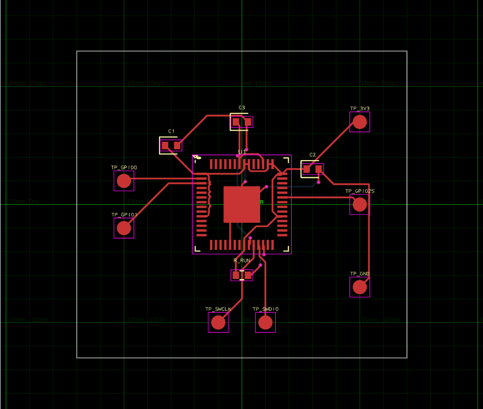
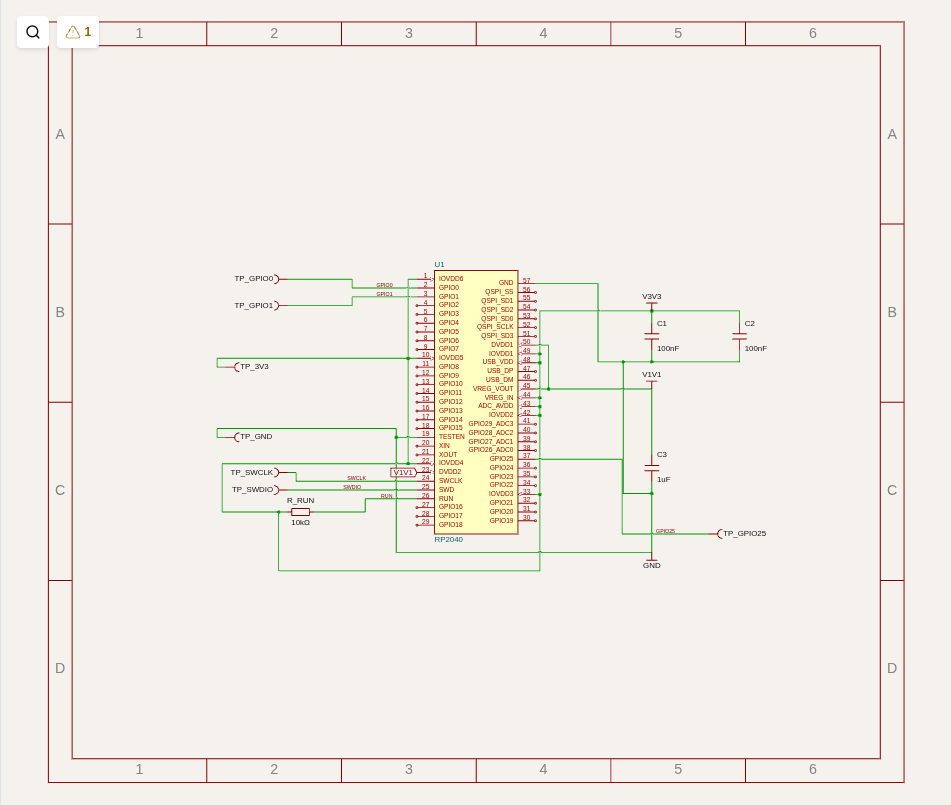
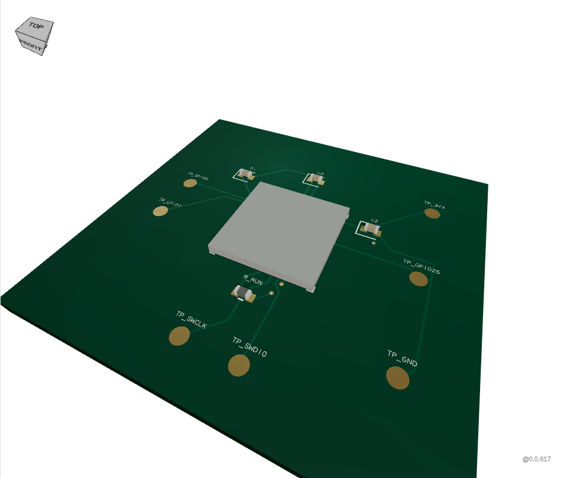

# Offline RunFrame

`tsci dev <entry>` serves the embedded RunFrame application at a bound
`http://127.0.0.1:<port>` origin. The browser is a local viewer and editor; the
binary evaluates circuits in its existing offline worker and supplies Circuit
JSON to RunFrame. No browser eval-version discovery or evaluator download is
needed. Dependency installation happens when building the binary.

```sh
bun install --frozen-lockfile
bun run build
./dist/tsci dev examples/rp2040-breakout.circuit.tsx --port 3020
```

Open the printed URL in a browser. The application provides PCB, schematic,
procedural 3D, BOM, errors, and Circuit JSON views; entry-source editing and
save/rebuild; dependency watching; embedded catalog search/import; and local
Circuit JSON/PCB SVG/schematic SVG downloads. `--project-dir` sets the source
boundary, `--timeout-ms` sets the render deadline, and `--port 0` chooses a free
loopback port. Ctrl+C stops the server.

The initial catalog remains RP2040/C2040. Importing from the UI creates
`imports/C2040.tsx` and preserves existing files. Add a local import to the
circuit to use it. The editor supports the entry file; dependency files can be
edited with an external editor. Syntax errors and unsupported imports remain
editable. Save requests carry a source revision so an external edit produces a
conflict instead of silently being overwritten. Rebuild uses saved files.

## Viewer assets and policy

The binary embeds the application JavaScript, CSS, HTML, favicon, Manifold
JavaScript/WASM, and a local Troika font. Browser builds use one React instance
isolated from the evaluator's React version. CAD initialization happens before
the viewer mounts so its ordinary CDN loaders never run. Unsupported Unicode
uses the font's missing-glyph outline locally.
The PCB view uses the canvas renderer so a WebGPU adapter is not required.
The current minified application JavaScript is 19,633,632 bytes. Trimming unused
viewer/exporter code is a follow-up before release; this does not change the
compact-footprint catalog admission policy.

The server binds only to IPv4 loopback. Every request must use the bound host,
and mutations additionally require that browser origin and a bounded JSON
body. It serves a fixed asset map and fixed source/catalog APIs, without a
general filesystem endpoint. Source/import paths must stay inside the project.
Its CSP restricts connections to the same origin. Script evaluation is enabled
for Manifold's generated JavaScript wrappers and WASM; this does not allow
external script origins.

RunFrame's offline mode omits cloud/file actions, feedback, telemetry, version
selection, issue reporting, and supplier links. Schematic inspection also
skips stock queries and remote footprint thumbnails and disables remote style
analysis. Unsupported exporters, simulation execution, remote CAD/image assets,
and solver downloads remain unavailable. Ordinary CAD is generated from local
footprints. Existing source-graph and evaluator guards still apply; this is
not an OS sandbox for arbitrary adversarial TypeScript.

## Upstream work

The UI pins the reviewed commits in these open PRs:

- [RunFrame #5618](https://github.com/tscircuit/runframe/pull/5618): controlled
  Circuit JSON/loading/errors, offline capabilities, lazy telemetry, static
  BOM conversion, and a source export.
- [schematic-viewer #285](https://github.com/tscircuit/schematic-viewer/pull/285):
  offline tooltips/context actions and a source export.

They are intentionally open for review. Replace the commit pins with qualified
published package versions after the upstream changes are reviewed and released.
The host bundler resolves RunFrame's existing `lib/*` aliases and replaces
unavailable optional features with local failures. Moving those capabilities
into explicit upstream dependency injection is follow-up work.

## Qualification

`tests/dev-server.test.ts` covers rendering, invalid-source recovery, saves,
revision conflicts, watches, imports, request validation, symlink boundaries,
and cancellation. Bun 1.3.12 can crash when terminating a worker while its trusted
eval dependency graph initializes; a readiness handshake defers that teardown
and cancels obsolete circuit execution safely.
Timeouts are reported promptly while initialization cleanup waits for readiness.
A native Bun initializer that permanently hangs cannot safely be force-killed
from this JavaScript API.

`scripts/smoke-dev-browser.ts` runs the compiled executable in a clean temporary
project, with no project dependencies or Bun/Node on the child's PATH. It records
browser requests, window CSP violations, dedicated-worker Chromium security
logs, console errors, and missing local assets. An attempted external request
fails qualification even when CSP blocks it. CI additionally runs this harness
in a network namespace with only loopback enabled. Browser evidence is uploaded
as a CI artifact.
A separate synthetic worker fixture first verifies that the monitor detects a
deliberate CSP-blocked request; that calibration is separate from product evidence.

Local Linux x64 qualification passed all 76 standalone tests and both typechecks.
The compiled browser run passed with 12 distinct same-origin URLs, zero external
request attempts, zero CSP violations, and no browser/console/local-asset errors.
It additionally checks Unicode CAD labels, offline supplier inspection and
style-analysis controls, all enabled views, import conflicts, and failure
recovery. The compiled import/build smoke also passed.

Captured RP2040 views from that browser run:

| PCB | Schematic | Procedural 3D |
| --- | --- | --- |
|  |  |  |

Official release, native qualification beyond Linux x64, and full redistribution
license review remain pending. The general schematic auto-layout issue recorded
in [circuit inspection](circuit-inspection.md) also remains; the RP2040 fixture
retains its explicit-placement workaround.
