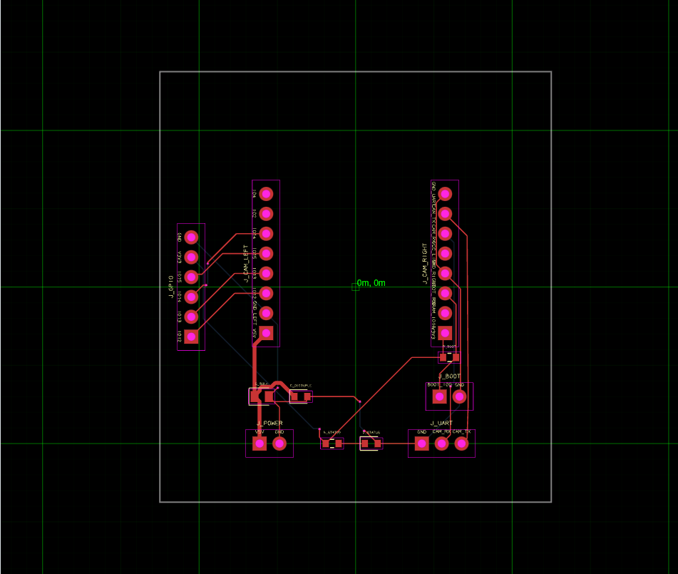
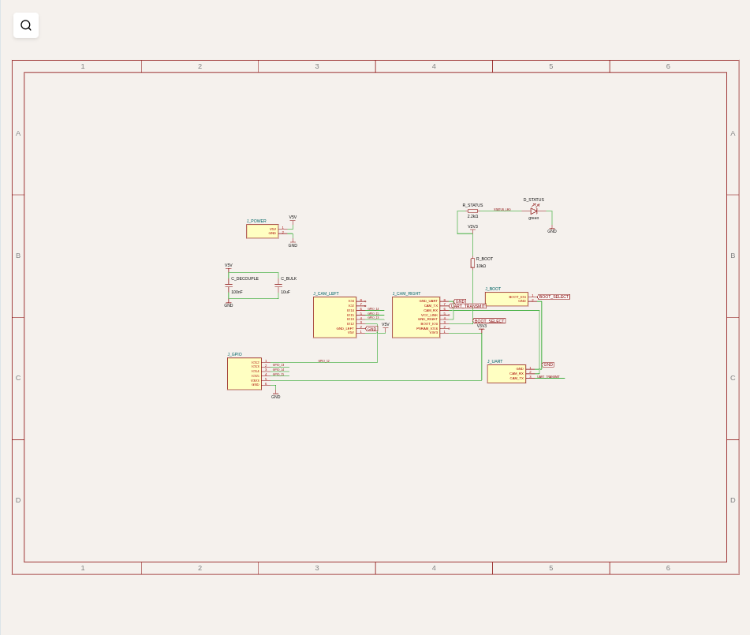
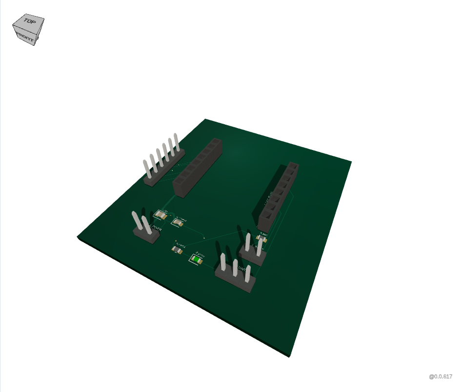

# Wi-Fi camera carrier qualification

The compiled Linux x64 binary built an ESP32-CAM socket carrier and rendered it
through ordinary RunFrame source evaluation. Native syscall tracing and browser
page/worker monitoring found **zero outbound request attempts** on the exercised
paths. This qualifies a carrier for a module with Wi-Fi and an OV2640 camera;
it does not qualify a discrete ESP32/RF/camera design or live camera operation.

The [example](../examples/wifi-camera-carrier.circuit.tsx) supplies regulated 5 V,
decoupling, a 3.3 V logic UART connector, a programming jumper/pull-up, a status
LED, and a diagnostic GPIO connector. Two eight-pin female sockets match the
manufacturer's signal positions, 2.54 mm pitch, and 22.86 mm row spacing.
GPIO0 is also camera XCLK, so its programming jumper must be opened during
operation. IO16 belongs to PSRAM; VCC is a selectable output, not the power
input. Those pins remain unconnected. GPIO12–15 share the module's microSD pins.
No supplier or MPN declarations were added to these locally authored parts.

## Results

| Check | Observed result |
| --- | --- |
| Native build | Exit 0; 11 components, 29 plated holes, 10 SMT pads, 24 routed PCB traces, 7 vias |
| Diagnostics | 0 core errors; 15 retained warnings: 11 generic missing MPNs and 4 intentionally unused socket pins |
| Connectivity | All 35 connected endpoints span the intended 11 nets; routes terminate at their referenced PCB ports and do not join different source nets |
| Module interface | All 16 socket positions and signals match the documented layout; 1 mm drills span both layers |
| Schematic | All 39 source ports have schematic and PCB ports, including the UART ground |
| Native networking | Three import misses and the carrier build make no Internet socket/connect/send attempts |
| Dev server networking | Syscall trace shows a bind on `127.0.0.1`; no outbound connect/send destination |
| Browser networking | 109 request events, 13 distinct resources at the bound loopback origin; 1 distinct worker URL |
| Browser failures | 0 external attempts, CSP violations, page errors, console errors, failed local requests, or worker-monitor errors |
| UI operations | PCB, schematic, 3D, BOM, Errors, Circuit JSON, component details, local style analysis, source saves, rebuild, and JSON/SVG downloads passed |
| Failure recovery | Declaring actual camera part C277946 fails in the browser worker with a local catalog error; restoring the source rebuilds successfully |

Native and browser runs independently pass the
[connectivity checker](../scripts/check-wifi-camera.ts). The clean temporary
project has no dependencies, tokens, or Bun/Node on the binary's PATH.
Its proxy settings point to an unused local port. Browser routes also reject
external destinations, and worker security logs detect CSP-denied attempts.
The monitor first proves that it can see a denied worker fetch using a separate
local calibration fixture. Blocking an automatic request would fail the product
test; an unreachable endpoint is not counted as success.

The [recorded summary](previews/wifi-camera/qualification.json) identifies the
binary and source hashes and preserves native diagnostics, browser resource
paths, and net/connector checks. The binary has the unchanged runtime graph from
`cbe986004d7f937abdebfd9a0ed4213a2c695681`; later main commits changed documentation.
This machine cannot create a network namespace (`unshare: Operation not
permitted`). CI repeats the carrier qualification with only loopback networking
and retains full traces, request logs, JSON, downloads, and screenshots.

## Issues found by inspecting the board

1. **Catalog coverage:** `tsci import C277946` (Ai-Thinker ESP32-CAM), C82899
   (Espressif ESP32-WROOM-32-N4), and C23380830 (TECH PUBLIC AP2112K-3.3TRG1)
   all exit 1 with "not bundled" and "No network lookup was attempted."
   Only C2040 is currently admitted. An explicit unknown MPN/supplier is still
   a catalog miss even when the circuit supplies a local footprint.
2. **Header CAD spacing:** the original combined
   `headermodule16_rows2_cols8_p2.54mm_py22.86mm_female` footprint puts holes at
   Y = ±11.43 mm, but `jscad-electronics` 0.0.213 places the two model rows at
   Y = ±1.27 mm. `Footprinter3d` omits `py`, and both header-row renderers
   hardcode 2.54 mm. The example now models its two actual sockets separately.
   A focused upstream fix forwards the row pitch; no standalone dependency
   replacement is needed for this fixture.
3. **Missing schematic pin:** core spreads an array of `pinLabels` into numeric
   keys starting at zero when resolving named pin arrangements. An eight-pin
   header with a reverse list of signal aliases consequently renders only
   physical pins 1–7. On this board that hid both IO4 and the connected UART
   ground, despite a build with no errors. Explicit `pin8` through `pin1`
   identifiers restore all ports. The checker now requires schematic coverage
   as well as PCB continuity; the general array-normalization fix belongs in core.
4. **Presentation and hardware limits:** A4 removes the original sheet-style
   warning. Some rail/BOOT/UART labels remain crowded near the right socket.
   The 3D view shows the carrier assembly, without the inserted module body,
   camera optics, or antenna keep-out. Module clearance, ground returns, current
   capacity, mechanical fit, and hardware/firmware operation still need review
   before manufacturing. A successful runtime build does not establish those.

### Inspected final views







## Next work

The highest priority is a build-time catalog admission pipeline, starting with
ESP32-CAM and supporting power/connector/passive parts. C277946's header interface
is compactly representable, but reference copper comparison, exact physical pin
mapping, socket geometry, module envelope, and provenance must pass the catalog
policy before admission. ESP32-WROOM modules need a verified recipe for their
unequal edge/underside pads; a generic QFN is not equivalent.

The MIT `common` AP2112 source has a valid five-pad footprinter recipe,
`dfn6_missing(5)_p0.95mm_w3.2001mm_pin1location(rightside,bottom)`, that the
standalone catalog's syntax regex currently rejects. Fix that validator as part
of catalog work, then compare geometry rather than assuming the common recipe
is qualified. C202112, Hirose FH12-24S-0.5SH(55), is a future camera-ribbon
candidate; its two mounting pads and bottom contact orientation require review.

After catalog coverage, the remaining release gates are a bounded browser
execution deadline, semantic tests for additional advertised exporters, native
execution on each advertised OS/architecture, and completed licenses/notices
and distribution metadata. Developer-only Solvers CDN paths stay outside this
qualification. No additional RunFrame props or shared platform interface changes
were needed for the carrier.

## Reproduce

On Linux with `strace` and a Chromium installation:

```sh
bun install --frozen-lockfile --ignore-scripts
bun run build
CHROMIUM_EXECUTABLE_PATH=/usr/bin/chromium \
  SMOKE_ARTIFACT_DIR=build/wifi-camera-evidence \
  bun scripts/smoke-wifi-camera.ts
```

The harness builds in a fresh project and saves native traces and artifacts,
browser/worker request evidence, connectivity results, six-view screenshots,
missing-part recovery, and exported JSON/SVGs. Existing native smoke and
network-namespace build loops include the new circuit. The existing RunFrame
monitoring helpers are shared without changing the original smoke entrypoint.

Primary identity/geometry references:
[Ai-Thinker module listing](https://jlcpcb.com/partdetail/C277946),
[manufacturer ESP32-CAM datasheet](https://datasheet.lcsc.com/lcsc/Ai-Thinker-ESP32-CAM-C277946.pdf),
[ESP32-WROOM listing](https://jlcpcb.com/partdetail/C82899),
[AP2112 listing](https://jlcpcb.com/partdetail/C23380830),
[pinned MIT AP2112 component](https://github.com/tscircuit/common/blob/a5797da88ec19944442d87392174af0a36fe1a0a/lib/Microcontroller_RP2040/imports/AP2112K_3_3TRG1.tsx),
and [Hirose camera connector listing](https://jlcpcb.com/partdetail/C202112).
